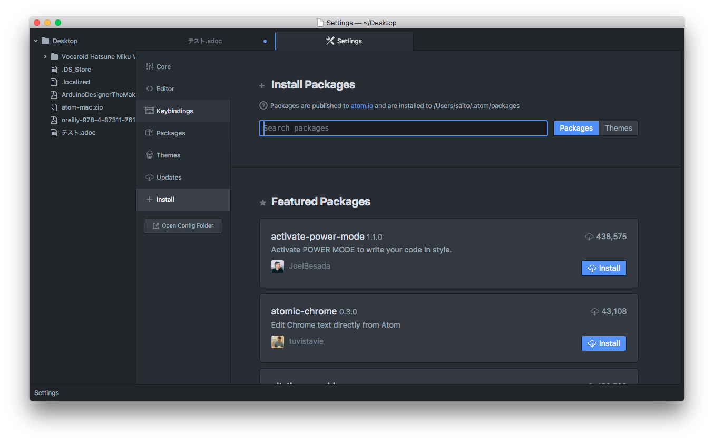

= http://asciidoc.org/[AsciiDoc]について

== それは何か

https://en.wikipedia.org/wiki/AsciiDoc[WikiPediaの説明(英語)]

AsciiDocは可読性が高い文書形式の一つ．

* 意味的にはDocBook XMLと同等であるが，
平文をマークアップする記法を使用している．
* テキストエディタで編集してそのまま読むことができたり，
HTMLやPDF, TeX, e-bookなどのDocBookがサポートする
他の形式に変換したりすることができる．
* 同様のドキュメントシステムとしてはいろいろあって，
たとえば https://github.com/kmuto/review[ReVIEW]，
http://www.sphinx-doc.org/[Sphinx]，
などがある．

== 経緯

* 平文を他の形式のファイルに変換するPythonプログラムが
2002年にStuart Rackhamによって作られた．
* https://github.com/asciidoctor/[AsciiDoctor]
と呼ばれるRuby実装が2013年にリリースされ，
https://github.com/[GitHub] によって使われている．
* いくつかのO'Reillyメディアの書籍やe-bookはAsciiDocを
使用して作成されている．

== ツール

=== エディタ

通常のテキストエディタでも記述できるが，
AsciiDocに対応しているとシンタックスの色付けや
プレビュー表示などができるようになる．

==== https://atom.io/[Atom]

* GitHubによって開発されたエディタ
* AsciiDoc対応のパッケージを追加インストールすることで
AsciiDocの編集が便利になる
* インストール画面は `Cmd+,` で設定画面を出し，
サイドバーの `install` をクリックすることで表示できる．

* 以下のパッケージを追加インストールする
** https://atom.io/packages/asciidoc-assistant[asciidoc-assistant]
** https://atom.io/packages/language-asciidoc[language-asciidoc]
** https://atom.io/packages/asciidoc-preview[asciidoc-preview]
** https://atom.io/packages/autocomplete-asciidoc[asciidoc-autocomplete]
** https://atom.io/packages/asciidoc-image-helper[asciidoc-image-helper]

=== 変換ソフト

AsciiDoc形式のファイルをPDF, TeX, HTMLなどの形式に変換する
ためのユーティリティ．

==== http://asciidoctor.org/[Asciidoctor]

GitHub リポジトリとして
https://github.com/asciidoctor[Asciidoctor]
もある．

===== 参考情報

* http://qiita.com/tukiyo3/items/4e8b002466a408dfb93a[AsciidoctorをdockerとAtomエディタでいい感じに使えた(Qiita)]

== AsciiDocの情報いろいろ

=== 紹介記事

* http://qiita.com/xmeta/items/de667a8b8a0f982e123a[AsciiDoc入門]

=== レファレンス

* http://asciidoctor.org/docs/asciidoc-syntax-quick-reference/[AsciiDoc Syntax Quick Reference]
* http://powerman.name/doc/asciidoc[AsciiDoc cheatsheet]

=== 実装例

* https://github.com/mitsut/toppers_kernel_spec[TOPPERS Kernel Specification for asciidoc]
** HTMLに変換したものが https://mitsut.github.io/toppers_kernel_spec/[ここ]で確認できる．
** Travis-CIを利用してコミット連動によりHTMLやPDFへの変換も行なっており，そのやり方についても参考になる．
